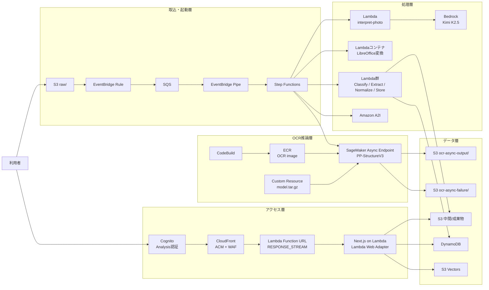
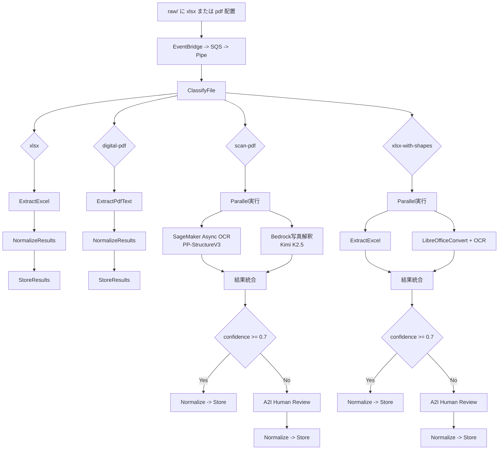

# aws-ai-ocr-pipeline-sample

製造業向け品質レポート（Excel / PDF）を取り込み、抽出・正規化・
人手確認・蓄積・分析までを一連で処理する AWS 基盤です。

## 現在の実装アーキテクチャ

本リポジトリの現行構成は、以下の責務で分離しています。

- 取込トリガー: `S3 (raw/)` + `EventBridge` + `SQS` + `EventBridge Pipe`
- オーケストレーション: `Step Functions`
- 文書抽出:
  - 文字・表・レイアウト解析: `SageMaker Async Inference` 上の
    `PP-StructureV3`（BYOC）
  - 写真の意味解釈: `Bedrock (Kimi K2.5)` を Lambda から呼び出し
- 変換補助: `Lambda コンテナ (LibreOffice)` で Excel 図形を含む資料を
  PDF へ変換して OCR 対象化
- 低信頼度時の確認: `Amazon A2I`（Human Loop）
- データ蓄積: `S3`（中間・成果物）+ `DynamoDB`（構造化結果）
- 公開・保護: `CloudFront`（ACM 証明書 + WAF）
- 分析可視化: `Next.js on Lambda`（Lambda Web Adapter、AnalysisStack 側）
  - RAG 検索: `S3 Vectors` + `Bedrock Titan Embed` + `Claude Sonnet`（SSE ストリーミング）

### アーキテクチャ図（Mermaid）



## スタック構成（CDK）

`infra/bin/infra.ts` で以下のスタックを連携しています。

- `QualityReportNetworkStack`: VPC / Security Group / Endpoint
- `QualityReportStorageStack`: S3 / DynamoDB
- `QualityReportEcrStack`: コンテナリポジトリ
- `QualityReportEcrDeployStack`: LibreOffice / Next.js 画像ビルド（CodeBuild）
- `QualityReportCodeBuildStack`: OCR 用 BYOC 画像ビルド
- `QualityReportOcrStack`: SageMaker 非同期エンドポイント（scale-to-0）
- `QualityReportReviewStack`: A2I フロー定義
- `QualityReportPipelineStack`: 実処理ワークフロー
- `QualityReportAnalysisStack`: 分析 UI（Next.js Lambda）と周辺コンポーネント

## 分析 UI（Next.js on Lambda）

`AnalysisStack` は Next.js を **Lambda Web Adapter (LWA)** でコンテナ Lambda 化して公開します。

### 構成

- ランタイム: `DockerImageFunction`（ARM64, 1536 MB）
- Lambda Web Adapter: `aws-lambda-adapter:0.9.1`（`RESPONSE_STREAM` モード）
- Function URL: `InvokeMode=RESPONSE_STREAM`（タイムアウト制約なし）
- CloudFront: Function URL をオリジンとして WAF を適用

### ECS Fargate + API Gateway からの移行理由

旧構成の API Gateway HTTP API には **29 秒固定タイムアウト**があり、
RAG 検索（Bedrock Claude によるストリーミング回答生成）が 504 エラーになっていました。
Lambda Function URL（`RESPONSE_STREAM`）により、この制約を解消しています。

### RAG 検索（SSE ストリーミング）

`/search` ページでは Bedrock の `ConverseStreamCommand` を使い、
回答テキストを **Server-Sent Events（SSE）** でリアルタイムにストリーミング表示します。

```
クエリ入力
  → Bedrock Titan Embed でベクトル化
  → S3 Vectors で類似検索（topK=10）
  → 参照情報を先行送出（SSE: refs イベント）
  → Bedrock Claude Sonnet でストリーミング回答生成（SSE: delta イベント）
  → 完了（SSE: done イベント）
```

## OCR 実行方式（現行）

`OcrStack` は `aws-ocr-vision-lab` と同じ方針で構成しています。

- ベース: SageMaker PyTorch DLC ベースの BYOC コンテナ
- 推論コード: `model.tar.gz` 内 `code/inference.py`
- モデル: `PP-StructureV3`（`text_recognition_model_name="PP-OCRv5_server_rec"`）
- PDF レンダリング: `PADDLE_PDX_PDF_RENDER_SCALE=2.0`（144 DPI 相当、PaddleX デフォルト）
- 呼び出し: `InvokeEndpointAsync`（非同期）
- 出力先:
  - 正常: `s3://<bucket>/ocr-async-output/`
  - 失敗: `s3://<bucket>/ocr-async-failure/`
- スケーリング:
  - `minCapacity = 0`, `maxCapacity = 1`
  - バックログメトリクスで 0/1 を自動制御

## 処理フロー

### 処理フロー図（Mermaid）



### 1. ファイル取込

1. 利用者が `S3 raw/` に `.xlsx` または `.pdf` を配置
2. EventBridge ルールがイベントを検知
3. SQS へ投入し、EventBridge Pipe が Step Functions を起動

### 2. ファイル種別判定

`ClassifyFile` で次の 4 種別に分岐します。

- `xlsx`
- `digital-pdf`
- `scan-pdf`
- `xlsx-with-shapes`

### 3. 種別別の実処理

- `xlsx`
  - `ExtractExcel` -> `NormalizeResults` -> `StoreResults`
- `digital-pdf`
  - `ExtractPdfText` -> `NormalizeResults` -> `StoreResults`
- `scan-pdf`
  - `Parallel` 実行
    - OCR: SageMaker 非同期 OCR（PP-StructureV3）
    - 写真解釈: Bedrock Kimi K2.5
  - 結果を統合し、信頼度判定へ
- `xlsx-with-shapes`
  - `ExtractExcel` と `LibreOfficeConvert + OCR` を並列実行
  - 結果を統合し、信頼度判定へ

### 4. 信頼度判定と人手確認

- 信頼度 `>= 0.7`
  - `NormalizeResults` -> `StoreResults` で完了
- 信頼度 `< 0.7`
  - `TriggerReview` で A2I Human Loop を開始
  - 完了イベント受信後に `NormalizeResults` -> `StoreResults`

### 5. 保存・分析

- 正規化済みデータを DynamoDB に保存
- 生成物・中間成果を S3 に保存
- ベクターを S3 Vectors に登録（Bedrock Titan Embed、1024 次元、COSINE 距離）
- AnalysisStack 側の Next.js UI から検索・分析に利用

## scan-pdf における役割分担

`scan-pdf` は、抽出目的に応じてエンジンを明確に分担しています。

- `PP-StructureV3`: 文字、表、文書レイアウト、ブロック情報
- `Bedrock Kimi K2.5`: 写真・画像領域の意味解釈

この分担により、帳票構造の正確な抽出と、写真内容の意味理解を
同一パイプラインで両立します。

## A2I レビュアー（Private Workforce）ユーザーの作成

低信頼度レポートの人手確認は **SageMaker ラベリングポータル** で行います。
作業者は **Workforce 専用 Cognito**（`QualityReportReviewStack` が作成）で
サインインします。Web アプリ（`QualityReportAnalysisStack`）の Cognito とは
**別ユーザープール** です。

| 項目 | 値（既定） |
|------|------------|
| User Pool 名 | `quality-report-a2i-workforce` |
| レビュアーグループ | `quality-reviewers` |
| Workteam 名 | `quality-report-quality-reviewers` |
| ラベリングポータル | `https://{SubDomain}.labeling.{region}.sagemaker.aws` |

ポータル URL は次でも確認できます。

- 品質レポート分析基盤の **レビュー管理** 画面の「ラベリングポータルを開く」
- CloudFormation 出力 `WorkteamNameOutput` を使った
  `aws sagemaker describe-workteam`（`Workteam.SubDomain`）

### スクリプトで作成（推奨）

`QualityReportReviewStack` デプロイ後、AWS CLI が利用できるシェルで実行します。

```bash
cd infra/scripts

# 初期パスワードを指定（メール送信なし）
EMAIL=reviewer@example.com TEMP_PASSWORD='YourPass1!' \
  ./create-workforce-user.sh

# 一時パスワードを Cognito からメール送信させる場合
EMAIL=reviewer@example.com ./create-workforce-user.sh
```

環境変数の主な指定:

| 変数 | 説明 |
|------|------|
| `EMAIL` | 必須。レビュアーのメールアドレス |
| `TEMP_PASSWORD` | 任意。8 文字以上・大文字・数字・記号を含む |
| `AWS_REGION` | 既定 `us-east-1` |
| `USER_POOL_ID` | 任意。未指定時はスタック出力から取得 |

### 手動で作成する場合

1. **Cognito** で User Pool `quality-report-a2i-workforce` を開く
2. **ユーザーの作成** — サインインはメール、メール検証済みにする
3. **グループ** `quality-reviewers` にユーザーを追加
4. **SageMaker** のラベリングポータル URL を開き、上記ユーザーでログイン

AWS CLI の例:

```bash
export AWS_REGION=us-east-1
export POOL_ID="$(aws cloudformation describe-stacks \
  --stack-name QualityReportReviewStack \
  --query "Stacks[0].Outputs[?OutputKey=='WorkforceUserPoolIdOutput'].OutputValue" \
  --output text)"

aws cognito-idp admin-create-user \
  --user-pool-id "$POOL_ID" \
  --username reviewer@example.com \
  --user-attributes Name=email,Value=reviewer@example.com Name=email_verified,Value=true \
  --message-action SUPPRESS

aws cognito-idp admin-set-user-password \
  --user-pool-id "$POOL_ID" \
  --username reviewer@example.com \
  --password 'YourPass1!' \
  --permanent

aws cognito-idp admin-add-user-to-group \
  --user-pool-id "$POOL_ID" \
  --username reviewer@example.com \
  --group-name quality-reviewers
```

### レビュー作業の流れ

1. Excel / PDF を `raw/` にアップロードし、パイプラインが信頼度 `< 0.7` で A2I に入る
2. **レビュー管理** の「レビュー待ち」にレポートが表示される
3. **ラベリングポータルを開く** → Workforce ユーザーでサインイン
4. ポータル上で元画像と AI 抽出結果を確認し、承認 / 修正 / 差し戻し
5. Human Loop 完了後、レポート一覧（`review_status: completed`）に反映

### トラブルシューティング

- **ポータルにログインできない** — Web アプリ用 Cognito ではなく、
  Workforce 用プールのユーザーを使っているか確認する
- **タスクが表示されない** — Human Loop が `InProgress` の間はポータルの
  キューに現れる。`quality-reviewers` グループ未所属だと割り当てられない
- **レビュー待ちが空** — デプロイ前に起動した Loop は DynamoDB 未登録の
  ことがある。再アップロードするか、ポータルで直接キューを確認する

## 実装上の補足

- リソース名に `paddleocr-vl` という識別子が一部残っていますが、
  現行の OCR 実処理は `PP-StructureV3`（`PP-OCRv5_server_rec` モデル）を使用します。
- OCR コンテナビルドは `QualityReportCodeBuildStack` の Custom Resource が
  自動実行します（通常、手動ビルドは不要）。
- Next.js コンテナビルドは `QualityReportEcrDeployStack` の Custom Resource が
  自動実行します（通常、手動ビルドは不要）。
