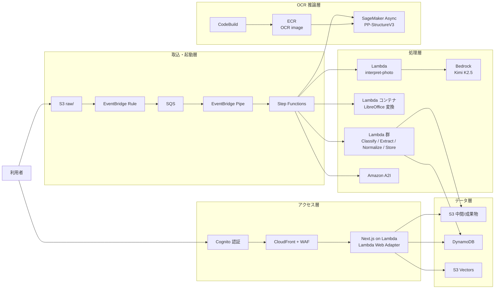
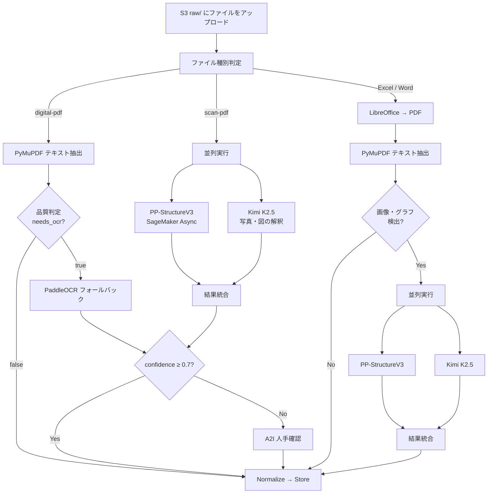

# aws-ai-ocr-pipeline-sample

PDF・Excel・Word ファイルを S3 にアップロードするだけで、テキスト抽出・レイアウト解析・画像解釈・RAG 検索までを自動処理する AWS サーバーレス AI OCR パイプラインのサンプル実装です。

製造業の品質レポートを題材にしていますが、**文書 AI 基盤のリファレンス実装**として汎用的に利用できます。

## このリポジトリで試せること

| 機能 | 使用技術 |
|---|---|
| デジタル PDF のテキスト・表抽出 | PyMuPDF + pymupdf4llm |
| スキャン PDF / 画像の OCR | PaddleOCR PP-StructureV3（SageMaker Async） |
| ページ品質判定・OCR 要否の自動判断 | `analyze_page()` による Hybrid OCR |
| Excel / Word → PDF 変換後の抽出 | LibreOffice Lambda |
| 写真・図の意味解釈 | Bedrock Kimi K2.5（マルチモーダル LLM） |
| 低信頼度時の人手確認フロー | Amazon A2I（Human In The Loop） |
| 抽出済みドキュメントへの自然言語検索 | S3 Vectors + Bedrock Titan Embed + Claude Sonnet（SSE ストリーミング） |
| Web UI での結果確認 | Next.js on Lambda Web Adapter |

## Hybrid OCR の特徴

このサンプルの最大の特徴は、**ファイル種別・ページ品質に応じてエンジンを自動切り替え**する Hybrid OCR パイプラインです。

```
デジタル PDF ─────→ PyMuPDF 直接抽出（高精度・高速・OCR 不要）
                         │ 文字化け・画像ページを検出
                         └─→ PaddleOCR フォールバック（OCR）
                                   │
                                   └─→ 信頼度 < 0.7 → A2I 人手確認

スキャン PDF ──────→ PaddleOCR（PP-StructureV3）
                     │ 並列実行
                     └─→ Bedrock Kimi K2.5（写真・図の意味解釈）

Excel / Word ──────→ LibreOffice → PDF 変換
                     → PyMuPDF テキスト抽出（必須）
                     → 画像・グラフを検出した場合は PaddleOCR + LLM 解釈も実行
```

## アーキテクチャ



## 処理フロー



## CDK スタック構成

`infra/bin/infra.ts` で以下のスタックを順番にデプロイします。

| スタック | 内容 |
|---|---|
| `StorageStack` | S3 / DynamoDB |
| `EcrStack` | コンテナリポジトリ |
| `EcrDeployStack` | LibreOffice / Next.js イメージビルド（CodeBuild） |
| `CodeBuildStack` | OCR BYOC イメージビルド |
| `OcrStack` | SageMaker 非同期エンドポイント（scale-to-0） |
| `ReviewStack` | A2I フロー定義・Workforce |
| `PipelineStack` | Step Functions ワークフロー・Lambda 群（VPC なし） |
| `AnalysisStack` | Next.js UI・CloudFront・RAG 検索（VPC なし） |

## 前提条件

- AWS アカウント（`us-east-1` リージョンを想定）
- Node.js 20+、pnpm
- Python 3.13+、uv
- Docker（CDK の Lambda バンドリング用）
- AWS CDK v2

## デプロイ手順

```bash
# 1. リポジトリをクローン
git clone https://github.com/your-org/aws-ai-ocr-pipeline-sample.git
cd aws-ai-ocr-pipeline-sample/infra

# 2. 依存関係をインストール
pnpm install

# 3. CDK Bootstrap（初回のみ）
AWS_PROFILE=your-profile npx cdk bootstrap

# 4. 全スタックをデプロイ（カスタムドメインなし）
AWS_PROFILE=your-profile npx cdk deploy --all --require-approval never

# カスタムドメインあり（Route53 Hosted Zone が必要）
AWS_PROFILE=your-profile npx cdk deploy --all --require-approval never \
  -c domainName=example.com \
  -c hostedZoneId=Z0123456789ABCDEF \
  -c hostedZoneName=example.com
```

> カスタムドメインを省略した場合は `*.cloudfront.net` ドメインで公開されます。ACM 証明書・Route53 レコードは作成されません。

デプロイ完了後、`AnalysisStack` の出力から Web UI の URL を確認できます。

```bash
AWS_PROFILE=your-profile aws cloudformation describe-stacks \
  --stack-name QualityReportAnalysisStack \
  --query "Stacks[0].Outputs[?OutputKey=='AppUrl'].OutputValue" \
  --output text
```

## 動作確認

デプロイ後、サンプルファイルを S3 にアップロードするとパイプラインが自動起動します。

```bash
BUCKET=$(aws cloudformation describe-stacks \
  --stack-name QualityReportStorageStack \
  --query "Stacks[0].Outputs[?OutputKey=='ExportsOutputRefReportBucket*'].OutputValue" \
  --output text)

# PDF をアップロード
aws s3 cp your-document.pdf s3://$BUCKET/raw/

# Step Functions の実行状況を確認
aws stepfunctions list-executions \
  --state-machine-arn $(aws stepfunctions list-state-machines \
    --query "stateMachines[0].stateMachineArn" --output text) \
  --max-results 1
```

## A2I レビュアーの作成

OCR 信頼度が低い（< 0.7）場合、Amazon A2I の人手確認フローに移行します。レビュアーを作成するにはスクリプトを使用します。

```bash
cd infra/scripts
EMAIL=reviewer@example.com TEMP_PASSWORD='YourPass1!' \
  ./create-workforce-user.sh
```

ラベリングポータルの URL は CloudFormation 出力 `WorkteamNameOutput` から確認できます。

```bash
WORKTEAM=$(aws cloudformation describe-stacks \
  --stack-name QualityReportReviewStack \
  --query "Stacks[0].Outputs[?OutputKey=='WorkteamNameOutput'].OutputValue" \
  --output text)

aws sagemaker describe-workteam --workteam-name $WORKTEAM \
  --query "Workteam.SubDomain" --output text
```

## OCR エンジンの詳細

### PaddleOCR PP-StructureV3（SageMaker Async）

- ベース: SageMaker PyTorch DLC BYOC コンテナ
- モデル: `PP-StructureV3`（`text_recognition_model_name="PP-OCRv5_server_rec"`）
- 呼び出し: `InvokeEndpointAsync`（非同期・scale-to-0 運用）
- 出力: テキスト・表・図のレイアウトブロック + 信頼度スコア

### PyMuPDF + pymupdf4llm

- デジタル PDF のテキスト・表を直接抽出（OCR 不要）
- `analyze_page()` でページ品質を判定し、OCR が必要なページのみ PaddleOCR に委譲
- `find_tables()` で表を Markdown 形式に変換

### Bedrock Kimi K2.5（マルチモーダル LLM）

- 写真・グラフ・図の意味解釈を担当
- PaddleOCR が抽出したテキストを補完する役割

## RAG 検索

抽出済みテキストを S3 Vectors にインデックスし、自然言語で横断検索できます。

```
クエリ入力
  → Bedrock Titan Embed v2（1024 次元）でベクトル化
  → S3 Vectors で類似検索（COSINE 距離、topK=10）
  → Bedrock Claude Sonnet で回答生成（SSE ストリーミング）
```

## 対応ファイル形式

| 形式 | 処理経路 |
|---|---|
| `.pdf`（デジタル生成） | PyMuPDF 直接抽出 → 必要に応じて OCR フォールバック |
| `.pdf`（スキャン） | PaddleOCR + LLM 写真解釈 |
| `.xlsx` / `.xls` | セル抽出 + LibreOffice → PDF → PyMuPDF / OCR |
| `.docx` / `.doc` | LibreOffice → PDF → PyMuPDF / OCR |

## コスト目安

主要コンポーネントのコスト特性です（`us-east-1`、参考値）。

| コンポーネント | 課金モデル |
|---|---|
| SageMaker Async Endpoint | リクエスト時のみ起動（scale-to-0）、処理時間課金 |
| Lambda 群 | 実行時間・メモリ課金（ARM64 で最適化済み） |
| Bedrock（Kimi K2.5） | トークン課金 |
| S3 / DynamoDB / S3 Vectors | ストレージ + API 呼び出し課金 |

SageMaker Endpoint は初回リクエスト時にコールドスタート（1〜3 分）が発生します。検証環境では利用後に手動でスケールダウンすることを推奨します。

## ライセンス

このリポジトリは [GNU Affero General Public License v3.0 (AGPL-3.0)](LICENSE) の下で公開されています。

> このリポジトリは PyMuPDF（AGPL-3.0）に依存しています。ネットワーク経由でこのソフトウェアを外部ユーザーに提供する場合、AGPL-3.0 に基づきソースコードを開示する義務が生じます。商用製品への組み込みには [Artifex 社の商用ライセンス](https://artifex.com/licensing/)の取得を検討してください。

主要な依存ライブラリのライセンス:

| ライブラリ | ライセンス |
|---|---|
| PyMuPDF / MuPDF | AGPL-3.0 |
| pymupdf4llm | Apache-2.0 |
| PaddleOCR | Apache-2.0 |
| AWS CDK | Apache-2.0 |
| Next.js | MIT |
| openpyxl | MIT |
