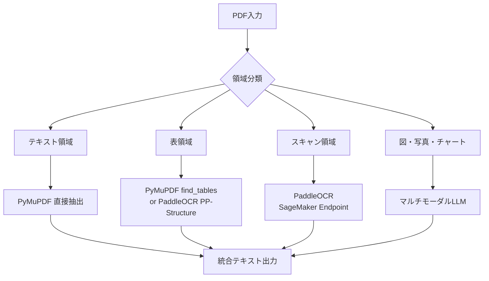
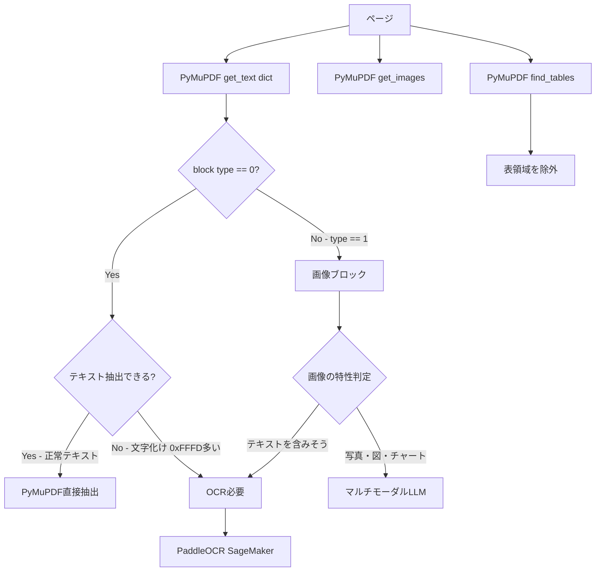
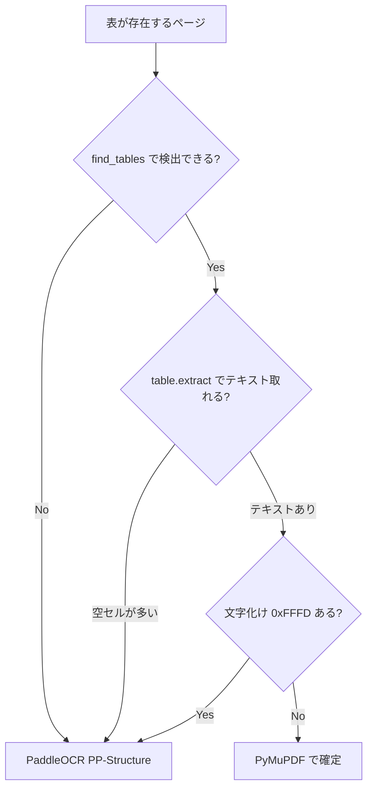
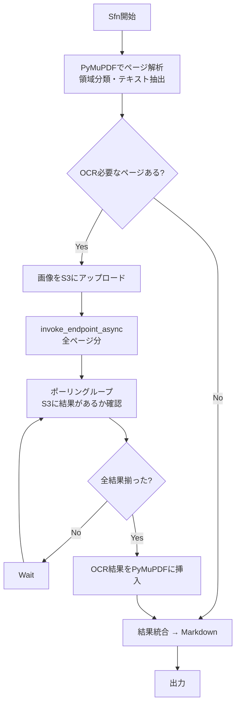

# PyMuPDF + PaddleOCR + マルチモーダルLLM 統合設計

## 1. 概要

PDF文書の解析パイプラインにおいて、PyMuPDF・PaddleOCR・マルチモーダルLLMの3ツールを適材適所で組み合わせる設計方針。

### ツールの役割整理

| 対象 | 最適なツール |
|---|---|
| デジタルPDFのテキスト | PyMuPDF（直接抽出、OCR不要） |
| スキャンPDF/画像中のテキスト | PaddleOCR |
| 表の構造化 | PyMuPDF `find_tables()` or PaddleOCR PP-StructureV3 |
| グラフ・チャートの**数値読取り** | PaddleOCR（軸ラベル・数値テキストの抽出）|
| グラフ・チャートの**意味解釈** | マルチモーダルLLM |
| 写真・図の内容理解 | マルチモーダルLLM |
| フローチャート・ダイアグラムの論理 | マルチモーダルLLM |

---

## 2. 各ツールの特性

### PyMuPDF

- PDF内部のテキストオブジェクトを直接パース → 正確
- デジタル生成されたPDF（Word→PDF等）であれば100%正確
- 表検出 (`find_tables()`) やメタデータ取得も可能
- ローカル完結、高速、依存なし

### PaddleOCR

- **「画像→テキスト」の変換器**（OCR本来の機能）
- 表の構造認識（PP-StructureV3）、レイアウト検出、数式認識
- **できないこと:** 写真・図の「意味」を理解する / 図中のデータから推論する / 文脈を踏まえた解釈

### マルチモーダルLLM

- **「画像→理解・解釈」**
- 図・写真・チャートの意味を問う場合に使用
- PaddleOCRでテキスト抽出した結果をコンテキストに含めつつ、図の画像自体もLLMに渡すのが最も精度が高い

---

## 3. PaddleOCRのPDF読み取りメカニズム

PaddleOCRはPDFを**直接テキスト抽出するのではなく、画像に変換してからOCRする**。

```
PDF → 画像化（ラスタライズ） → 前処理 → テキスト検出 → テキスト認識
```

1. PDF → 画像変換: `pdf2image`（poppler依存）または`PyMuPDF(fitz)`でページをピクセル画像に変換
2. 画像リサイズ: `text_det_limit_side_len` に基づいてリサイズ（デフォルト: 最短辺736px以上、最長辺4000pxまで）
3. テキスト検出 (Detection): DBモデルでテキスト領域のバウンディングボックスを検出
4. テキスト認識 (Recognition): 検出された各テキスト行を切り出し、CRNN系モデルで文字認識

### PaddleOCR単体でPDFを読むと精度が落ちる原因

| 原因 | 詳細 |
|---|---|
| 画像化時の解像度不足 | ラスタライズのDPIが低いと小さい文字が潰れる |
| limit_side_lenによるリサイズ | モデル入力サイズの制約で細かい文字の解像度が落ちる |
| 検出モデルのミス | 密集テキスト・小フォント・装飾的レイアウトで文字抜け |
| 認識モデルの限界 | 切り出し画像の品質が悪い場合に誤認識 |
| PDFのテキスト情報を無視 | 埋め込みテキスト情報を使わず純粋に画像として認識 |

**結論:** デジタル生成されたPDFをPaddleOCR単体で処理するのは原理的に非効率かつ不正確。PyMuPDFでテキスト抽出→取れない部分だけPaddleOCRにフォールバックするのが最適解。

---

## 4. パイプライン全体設計



---

## 5. 領域分類の処理

PyMuPDFが返すブロック情報を組み合わせて判定する。専用の分類モジュールは不要。

### ブロックタイプ

```python
import pymupdf

doc = pymupdf.open("document.pdf")
page = doc[0]

data = page.get_text("dict")
for block in data["blocks"]:
    if block["type"] == 0:
        # テキストブロック → PyMuPDFで直接テキスト抽出済み
        pass
    elif block["type"] == 1:
        # 画像ブロック → 図・写真・チャートの候補
        pass
```

### 判定フロー



### 判定基準

| 判定 | 条件 | 処理先 |
|---|---|---|
| デジタルテキスト | `block["type"] == 0` かつ正常なUnicode文字 | PyMuPDF直接 |
| OCR必要テキスト | `block["type"] == 0` だが `0xFFFD`（置換文字）が多い | PaddleOCR |
| 表 | `page.find_tables()` で検出された領域 | PyMuPDF or PaddleOCR |
| スキャンページ | テキストブロックがほぼなく画像が全面を覆う | PaddleOCR（全ページOCR） |
| 図・写真 | `block["type"] == 1` の画像で、テキスト含有率が低い | マルチモーダルLLM |

### PyMuPDF4LLMの analyze_page() 活用

PyMuPDF4LLMにはページ単位の自動判定関数が組み込まれている：

```python
from pymupdf4llm.helpers.utils import analyze_page

analysis = analyze_page(page)
```

| キー | 型 | 説明 |
|---|---|---|
| `needs_ocr` | bool | OCR推奨判定 |
| `reason` | str | 判定理由（`chars_bad`, `img_text`, `vec_text`, `ocr_spans`） |
| `img_joins` | float | 画像がページを覆う割合 |
| `txt_joins` | float | テキストがページを覆う割合 |
| `chars_bad` | int | 不正文字（0xFFFD）の数 |
| `vec_suspicious` | int | ベクターで描かれた疑似テキストの数 |

---

## 6. 表処理の判定

表をPyMuPDFで処理すべきかPaddleOCR（PP-Structure）に回すべきかの自動判定専用関数は存在しない。**「PyMuPDFでまず試して、ダメならOCRにフォールバック」**が現実的な戦略。

### PyMuPDFの表出力形式

| メソッド | 出力 | 用途 |
|---|---|---|
| `table.extract()` | `list[list[str]]` — 2次元リスト | プログラム処理向け |
| `table.to_markdown()` | GitHub互換Markdownテーブル文字列 | LLM入力 / ドキュメント生成 |
| `table.to_pandas()` | pandas DataFrame | データ分析 / 後処理 |

### 判定フロー



### 判定関数の実装例

```python
import pymupdf

def should_use_ocr_for_tables(page):
    """表処理をPyMuPDFで行うかOCRに回すか判定"""
    tables = page.find_tables()

    if not tables.tables:
        return True  # 表が検出できない → PaddleOCR

    for table in tables.tables:
        cells = table.extract()
        total_cells = sum(len(row) for row in cells)
        empty_cells = sum(1 for row in cells for c in row if not c or not c.strip())

        if total_cells > 0 and empty_cells / total_cells > 0.8:
            return True  # セルの大半が空 → PaddleOCR

    return False
```

### PyMuPDF vs PaddleOCR PP-Structure の使い分け

| 条件 | 選択 |
|---|---|
| デジタルPDF（罫線あり） | **PyMuPDF** — 正確、高速、罫線ベースで確実 |
| デジタルPDF（罫線なし/背景色区切り） | PyMuPDFでも可能だが精度はケースバイケース |
| スキャンPDF/画像内の表 | **PaddleOCR PP-Structure** — 画像認識ベース |
| 複雑な結合セル | PyMuPDFは `None` セルで表現（`to_markdown(fill_empty=True)`で補完） |

---

## 7. SageMaker連携

### 7.1 同期エンドポイント（参考）

PyMuPDF4LLMの `ocr_function` パラメータにカスタム関数を渡す方式。小規模・リアルタイム処理向け。

```python
import pymupdf
import pymupdf4llm
import boto3
import json

sagemaker_runtime = boto3.client("sagemaker-runtime", region_name="ap-northeast-1")

def sagemaker_paddleocr(page, pixmap=None, dpi=300, language="eng"):
    """SageMaker同期EndpointのPaddleOCRを呼び出すOCRプラグイン"""
    if pixmap is None:
        pixmap = page.get_pixmap(dpi=dpi)

    img_bytes = pixmap.tobytes("png")

    response = sagemaker_runtime.invoke_endpoint(
        EndpointName="your-paddleocr-endpoint",
        ContentType="application/x-image",
        Body=img_bytes,
    )
    result = json.loads(response["Body"].read())

    page_rect = page.rect
    scale_x = page_rect.width / pixmap.width
    scale_y = page_rect.height / pixmap.height

    for item in result:
        bbox = item["bbox"]
        x0 = min(p[0] for p in bbox) * scale_x
        y0 = min(p[1] for p in bbox) * scale_y
        x1 = max(p[0] for p in bbox) * scale_x
        y1 = max(p[1] for p in bbox) * scale_y
        rect = pymupdf.Rect(x0, y0, x1, y1)
        page.insert_text(rect.bl, item["text"], fontsize=rect.height * 0.8, render_mode=3)

    return None

md = pymupdf4llm.to_markdown("scanned.pdf", ocr_function=sagemaker_paddleocr, force_ocr=True)
```

### 7.2 非同期エンドポイント + Step Functions（本番方式）

PaddleOCRがSageMaker非同期エンドポイントにデプロイされている場合、既存のStep Functionsポーリングループと組み合わせる。

#### アーキテクチャ



#### 各ステップの役割

| Step | 処理 | 実行環境 |
|---|---|---|
| 1. Parse | PyMuPDFでPDF解析、`analyze_page()`で判定、テキスト抽出 | Lambda (PyMuPDF) |
| 2. Upload | OCR必要ページの画像をS3にput | 同上Lambda内 |
| 3. Invoke | `invoke_endpoint_async` を全ページ分呼び出し | 同上 or 別Lambda |
| 4. Poll | S3にoutputがあるか確認 | Sfn Wait + Lambda |
| 5. Merge | OCR結果取得 → PyMuPDFでテキスト挿入 → Markdown生成 | Lambda (PyMuPDF) |

#### 既存Sfnとの差分

```
[既存] 入力 → PaddleOCR呼び出し → ポーリングループ → 結果取得
[変更] 入力 → [NEW]PyMuPDF解析 → PaddleOCR呼び出し → ポーリングループ → 結果取得 → [NEW]統合・Markdown化
```

ポーリングループ部分はそのまま流用可能。

#### Step 1+2+3: 解析・アップロード・非同期呼び出し

```python
import pymupdf
import boto3

s3 = boto3.client("s3")
sagemaker_runtime = boto3.client("sagemaker-runtime")

def handler_parse(event, context):
    bucket = event["bucket"]
    pdf_key = event["pdf_key"]

    obj = s3.get_object(Bucket=bucket, Key=pdf_key)
    doc = pymupdf.open(stream=obj["Body"].read(), filetype="pdf")

    pages_need_ocr = []
    pages_text = {}

    for i, page in enumerate(doc):
        text = page.get_text()
        if text.strip():
            pages_text[i] = text
        else:
            pix = page.get_pixmap(dpi=200)
            img_key = f"ocr-input/{pdf_key}/{i}.png"
            s3.put_object(Bucket=bucket, Key=img_key, Body=pix.tobytes("png"))

            resp = sagemaker_runtime.invoke_endpoint_async(
                EndpointName="your-paddleocr-async-endpoint",
                InputLocation=f"s3://{bucket}/{img_key}",
                ContentType="application/x-image",
            )
            pages_need_ocr.append({
                "page": i,
                "input_key": img_key,
                "output_location": resp["OutputLocation"],
            })

    return {
        "bucket": bucket,
        "pdf_key": pdf_key,
        "pages_text": pages_text,
        "pages_need_ocr": pages_need_ocr,
    }
```

#### Step 4: ポーリング確認（既存Lambda流用）

```python
def handler_check(event, context):
    for item in event["pages_need_ocr"]:
        bucket, key = parse_s3_uri(item["output_location"])
        try:
            s3.head_object(Bucket=bucket, Key=key)
            item["completed"] = True
        except:
            item["completed"] = False

    all_done = all(item["completed"] for item in event["pages_need_ocr"])
    return {**event, "all_done": all_done}
```

#### Step 5: 結果統合・Markdown生成

```python
import pymupdf
import pymupdf4llm
import json

def handler_merge(event, context):
    bucket = event["bucket"]
    pdf_key = event["pdf_key"]

    obj = s3.get_object(Bucket=bucket, Key=pdf_key)
    doc = pymupdf.open(stream=obj["Body"].read(), filetype="pdf")

    for item in event["pages_need_ocr"]:
        out_bucket, out_key = parse_s3_uri(item["output_location"])
        result = json.loads(s3.get_object(Bucket=out_bucket, Key=out_key)["Body"].read())

        page = doc[item["page"]]
        pix = page.get_pixmap(dpi=200)
        scale_x = page.rect.width / pix.width
        scale_y = page.rect.height / pix.height

        for det in result:
            bbox = det["bbox"]
            x0 = min(p[0] for p in bbox) * scale_x
            y0 = min(p[1] for p in bbox) * scale_y
            x1 = max(p[0] for p in bbox) * scale_x
            y1 = max(p[1] for p in bbox) * scale_y
            rect = pymupdf.Rect(x0, y0, x1, y1)
            page.insert_text(rect.bl, det["text"], fontsize=rect.height * 0.8, render_mode=3)

    md = pymupdf4llm.to_markdown(doc)
    s3.put_object(Bucket=bucket, Key=f"output/{pdf_key}.md", Body=md.encode())
    return {"output_key": f"output/{pdf_key}.md"}
```

#### 注意点

| 項目 | 内容 |
|---|---|
| S3一時ファイル | 入力/出力ともにS3経由。処理後にクリーンアップが必要 |
| コールドスタート | インスタンス0台の場合、最初のリクエストで起動待ち（数分） |
| ポーリング間隔 | Sfn Waitで5〜10秒程度が適切 |
| 同時実行数 | `MaxConcurrentInvocationsPerInstance` の設定に注意 |
| Lambda メモリ | PyMuPDFの画像化処理はメモリ消費大。大きいPDFは1024MB以上推奨 |
| SNS通知 | ポーリングの代わりにSNS→EventBridge→Sfnで完了通知を受ける方式も可能 |
| 座標変換 | Pixmapのピクセル座標 → PDFポイント座標への変換が必要 |
| テキスト挿入 | `render_mode=3`（不可視テキスト）で挿入するのが定石 |
| CJKフォント | 日本語テキスト挿入時は`pymupdf-fonts`等の指定が必要 |

---

## 8. 付録: PyMuPDF4LLM OCRプラグイン一覧

| Plugin Name | Engines | Description |
|---|---|---|
| rapidocr_api | RapidOCR | RapidOCRで検出・認識 |
| paddleocr_api | PaddleOCR | PaddleOCRで検出・認識 |
| tesseract_api | Tesseract OCR | Tesseractで検出・認識 |
| rapidtess_api | RapidOCR + Tesseract | RapidOCRで検出、Tesseractで認識 |
| paddletess_api | PaddleOCR + Tesseract | PaddleOCRで検出、Tesseractで認識 |

自動選択の優先順位:
1. rapidtess_api（RapidOCR + Tesseract両方あり）
2. paddletess_api（PaddleOCR + Tesseract両方あり）
3. rapidocr_api（RapidOCRのみ）
4. paddleocr_api（PaddleOCRのみ）
5. tesseract_api（Tesseractのみ）

### OCRプラグインインターフェース

カスタムOCR関数を作る場合のシグネチャ：

```python
def my_ocr_function(page, pixmap=None, dpi=300, language="eng"):
    """
    page: pymupdf.Page オブジェクト
    pixmap: ページを画像化したPixmap（またはNone）
    dpi: 解像度
    language: 言語コード
    戻り値: None（テキストをpage内に直接挿入する）
    """
```

---

## 9. 付録: MCP (Model Context Protocol) サーバー

PyMuPDF公式でMCPサーバーが提供されており、AI coding agentやLLMアプリケーションからPDF処理を呼び出せる。

### 関連プロジェクト

| プロジェクト | 説明 |
|---|---|
| [pymupdf/pymupdf4llm-mcp](https://github.com/pymupdf/pymupdf4llm-mcp) | PyMuPDF公式MCPサーバー |
| [ai-zerolab/pymupdf4llm-mcp](https://github.com/ai-zerolab/pymupdf4llm-mcp) | コミュニティ版MCPサーバー（pdf→md変換） |
| [pymupdf/langchain-pymupdf4llm](https://github.com/lakinduboteju/langchain-pymupdf4llm) | LangChain統合パッケージ |

### 用途

- AI agentにPDF解析能力を付与（MCP経由でPyMuPDF4LLMを呼び出し）
- RAGパイプラインでのドキュメントローダーとして利用
- LangChain/LlamaIndex等のフレームワークとの統合
